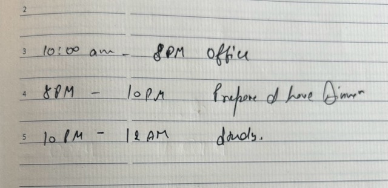

# Clarity

Sync your handwritten daily planner with google calendar so you can reminders so you have better clarity about schedule and timely reminder.

- Uses Gemini to OCR and parse data
- SQLite DB
- Echo web framework

# Routes

GET `/auth/google`

> Response

```
{
  "token": "JWT TOKEN HERE"
}
```

#

GET `/calendar`

> Response

```
{
  "eventName": "name of your event",
  "startTime": "start time of your event",
  "endTime": "end time of your event",
}
```

#

POST `/calendar`

> Request

```
[{
  "eventName": "name of your event",
  "startTime": "start time of your event",
  "endTime": "end time of your event",
}]
```

> Response

```
{
  "eventName": "name of your event",
  "startTime": "start time of your event",
  "endTime": "end time of your event",
}
```

## .env file

Create new file with following environment variables

```
PORT=3000
GOOGLE_CLIENT_KEY="GOOGLE CLIENT ID HERE"
GOOGLE_CLIENT_SECRET="GOOGLE CLIENT SECRET HERE"
GOOGLE_REDIRECT_URL=http://127.0.0.1:3000/auth/google/callback
SQLITE_DB_PATH=test.db
ENCRYPTION_KEY="32bit encryption key for refresh token"
GEMINI_API_KEY="GEMINI API KEY"
```

## Example of day planner



## Future improvements

- Queuing

- Rate Limiting

- PATCH for calendars

- UI support
